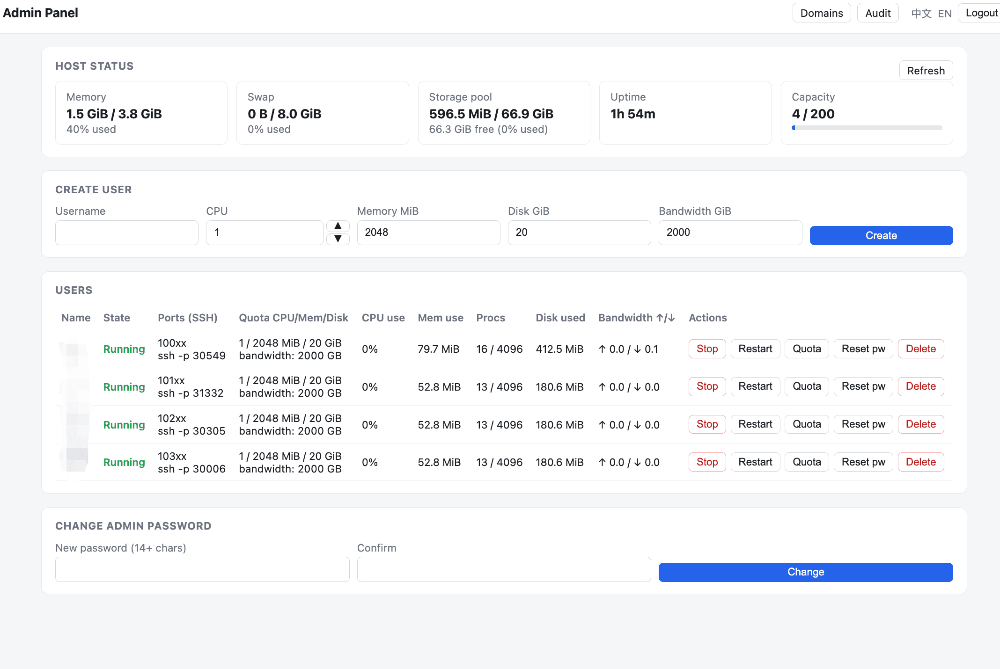
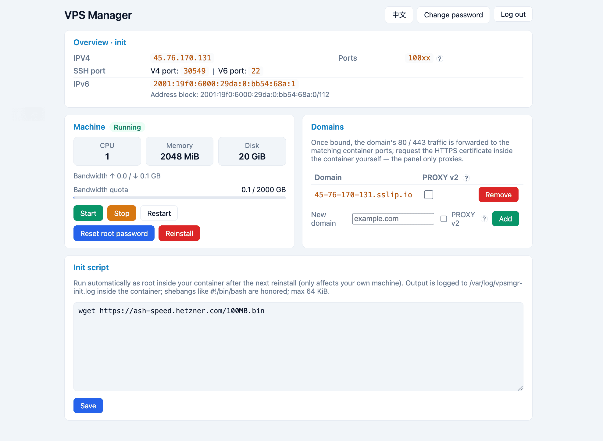

# Vpsmgr Lite

**Warning ⚠️ The "VMs" this project creates are LXC containers, not real
virtual machines. Their isolation and security are far weaker than other
virtualization approaches (KVM/QEMU, etc.). A kernel-level or container escape
would affect the host and every tenant. Security risk is yours to accept — do
not run untrusted or high-security workloads on a shared host.**

[简体中文](README.zh-CN.md) · [Docs](docs/README.md)

A toy LXC hosting panel for small machines (≤ 4 GB RAM, small VPS): one Debian
13 container per user, managed from a web panel (start/stop/restart/reinstall),
with automatic NAT4 port forwarding and 80/443 per-domain proxying by Traefik.
Optional IPv6 pass-through (no NAT). The panel is a single small Go binary and
the container image stays slim — storage and memory are treated as scarce.

Install notes: shared IPv4 inbound is always ON by default (flip it later with
`vps config set net.v4_forward true|false`); the only network choice the
installer asks for is the container subnet's second octet. Port 25 (SMTP) is
always blocked for containers, both directions — anti-spam, no toggle.

## Install

**Minimum: Debian 12/13 or Ubuntu 22.04/24.04/26.04 (bare metal or KVM), 1 core, 1.5G RAM, 10G free disk, and root access**

Both amd64 and arm64 are supported; testing has primarily been done on amd64.

```
git clone https://github.com/bluebluesoda/lxc-hosting.git && cd lxc-hosting
sudo ./install.sh                  # install the stable prebuilt binary
#sudo ./install.sh --local-build   # force a local build from source
```

The installer configures the Zabbly Incus LTS repository and installs Incus 7
LTS (Debian packages — the same repo serves Ubuntu, so the panel is portable
across both).

To enable IPv6 pass-through, make sure the host has been assigned an entire
routed prefix. Ask your provider, or use the check script in this repository
for an informal test.

**Be sure the entire IPv6 prefix works before installing with IPv6 support.**

```
bash check-ipv6-support.sh # IPv6 test script
```

Run `vps panel-url` after installation to get the full panel address —
`https://<IP>:<port>/<random-path>` (the port is a random free one in
2000-9999). This random path is the panel's only entry point.

## Optional: extra OS images

The default is Debian 13. To let users reinstall their container with a
RHEL-family system, run (once, as root) the optional image builder — it is NOT
run by `install.sh` so small boxes stay lean:

```
sudo bash scripts/60-rhel-image.sh          # Alma 9
sudo bash scripts/60-rhel-image.sh rocky     # Rocky 9
```

Reinstall then offers the built images as a choice (always, even with only the
default). The image is slimmed and the base image deleted, same as the Debian
one.

## Usage

```
vps add <name> [--cpu N] [--mem NG] [--disk NG]   # default 1 core / 1G / 10G; cpu = whole cores (>=1) or a decimal 0.1..0.9; password is auto-generated and shown once
vps quota <name> [--cpu N] [--mem N] [--disk NG]  # disk can only grow
vps passwd <name>                                 # reissue user panel password (shown once)
vps list [name]                                   # all users, or one user's detail
vps power <name> start|stop|restart
vps del <name>
vps panel-url
vps config set net.v4_forward true|false   # shared IPv4 inbound: false = IPv6-only containers
```

Users can set a custom **init script** in their panel — it runs as root inside
their container after a reinstall (output at `/var/log/vpsmgr-init.log`), for
cloud-provider-style first-boot automation.

Admins can set a per-user monthly **bandwidth quota** (GiB, upload + download);
a container that exceeds it is rate-limited to **1Mbps** both directions. The
limit is applied live via Incus (tc qdiscs) — no container restart.

Domains can opt into **PROXY protocol v2** (the 443 TLS passthrough reports the
visitor IP to the backend, which must support it; HTTP/80 keeps normal
`X-Forwarded-For` headers). An admin **domain management** page lists every
domain with its owner and last-modified time (UTC, shown in the browser's
timezone) and can toggle the setting or delete domains.

An **audit log** records resource-heavy user actions — power, reinstall, root
password reset, domain config changes. Rows are attributed to the acting
username, or `000+<username>` when an admin acts on that user's resources. The
admin audit page loads it in 500-row chunks with infinite scroll; the latest
5000 entries are kept.

## Config

`/etc/vpsmgr/config.yaml` (auto-generated at install) — **the defaults are not
meant to be changed**. The sanctioned interface is `vps config list/set/help`,
which validates every change and refuses immutable fields. Reference:
[docs/configuration.md](docs/configuration.md).

## Uninstall

```
sudo ./uninstall.sh          # remove software, keep config/db/containers
sudo ./uninstall.sh --purge  # also delete config/db, containers, pool, Incus
```

## Documentation

Technical detail lives in `docs/` (English): [index](docs/README.md), plus
[`AGENTS.md`](AGENTS.md) for AI coding agents.

## Screenshots

Admin panel:



User panel:


